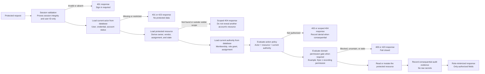

# Reliance Epic 3 Authorization Architecture Diagram

**Document type:** Epic 3 implementation architecture
**Status:** Proposed for Product Owner approval
**Planning baseline:** `43c18f9282d14567ce4c40b1fab32bfb97126817`
**Implementation:** Not started

This diagram defines the permanent protected-request rule for Epic 3. It does not change the frozen product, consent, language, or UX standards.

## Permanent Rule

> The session tells Reliance **who** made the request. The current database state tells Reliance **what that actor is allowed to do**.

Reliance must never authorize a protected action from:

- `session.role`;
- `session.availableProfiles`;
- `browser.role` or browser storage;
- a role in a URL, query string, form, or request body;
- a role or user ID in a compatibility cookie;
- cached membership, ownership, assignment, account status, or admin authority; or
- the fact that a protected button or page is visible.

## Canonical Request Flow

## Responsibility of Each Layer

| Layer | What it may prove | What it may never prove |
|---|---|---|
| Session | Session integrity, user ID, issue/expiry metadata, authentication method | Current role, membership, ownership, assignment, permission, or admin authority |
| Actor | Current user exists and may act; current credential/account state | Access to a particular vendor, customer record, assignment, or admin tool |
| Resource | Which customer, vendor, employee assignment, work record, media, review, or admin object is being requested | That the requester may access it |
| Ownership | Whether the current actor owns the customer-scoped resource | Vendor, employee, or admin authority |
| Membership | Current exact-vendor role and status | Customer ownership, current assignment, consent, or Public visibility |
| Admin role grant | Current database-backed platform authority | Customer/vendor/employee participant authority or permission to impersonate |
| Authorization policy | Whether this actor may perform this action on this resource now | Recording/publication permission that belongs to a separate domain gate |
| Permission gate | Consequential workflow permission such as Epic 1 recording unlock | Authentication, role, membership, or ownership |
| Protected resource | The approved read or mutation | Broader fields or adjacent resources not covered by the policy |
| Response | Minimum authorized data and stable status/error | Raw secrets, internal tokens, another tenant's data, or cached role claims |

## Database Rebuild Requirement

For every protected request, the server must reload all authorization facts needed by that action:

1. Current `User` and account status.
2. Current database-backed platform role grant for admin actions.
3. Current exact-vendor `VendorMembership` for vendor or employee actions.
4. Current resource owner for customer actions.
5. Current assignment for employee work-record actions.
6. Current domain permission state when the workflow requires it.

Short-lived request-local memoization is allowed only within one server request after these facts are loaded. Authorization facts must not be reused across requests from a browser cache, process cache, session role claim, or previously rendered page.

## Fail-Closed Rule

If Reliance cannot verify the current actor, resource, ownership, membership, assignment, platform role, or required permission, it does not perform the protected action and does not return protected data.

An infrastructure failure is not permission. A visible UI control is not permission. A previously valid role is not current authority.

## Phase Boundary

### Epic 3 Phase A - Identity Foundation

Implements the complete request flow through protected response:

- session identity boundary;
- canonical database actor;
- ownership and exact-vendor membership;
- database-backed admin authority;
- authorization policies;
- API protection and IDOR controls;
- existing domain permission gates preserved.

Phase A stops for Product Owner validation after tests and documentation.

### Epic 3 Phase B - Identity Lifecycle

Hardens how the session and identity are created, recovered, synchronized, and revoked:

- password reset;
- passkeys;
- MFA and trusted devices;
- employee invite acceptance;
- durable session revocation and logout everywhere;
- cross-tab synchronization.

Phase B may not begin until Phase A is approved.
