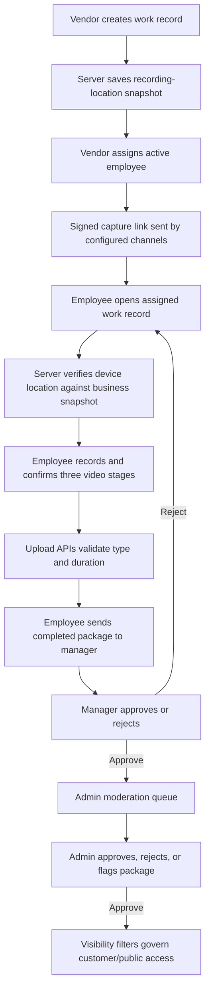
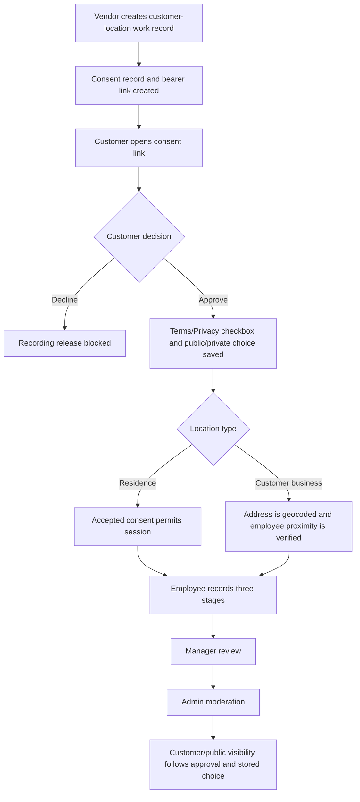
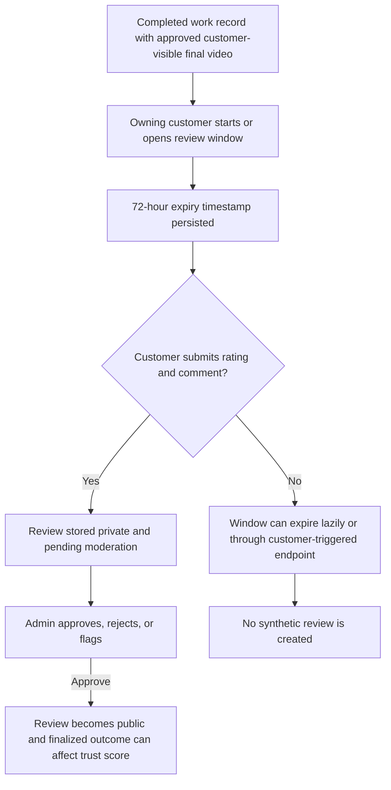

# Reliance Current Consent, Privacy, and Recording Audit

Audit date: 2026-07-30

Repository reviewed: `C:\Users\Cesar Olivera\Project Reliance`

Branch reviewed: `cursor-latest-build`

## CURRENT PLATFORM BASELINE

This report establishes the current executable implementation as the official baseline for future Reliance design work.

The baseline is limited to behavior verified in active application code, routes, React components, API endpoints, middleware, current configuration use, database schema, storage logic, notification logic, and current rendered UI. Historical conversations, archived specifications, planning documents, prototypes, TODOs, and prior design concepts are not evidence of current behavior.

When documentation conflicts with executable code, the implementation wins. A statement rendered in an active policy or interface is evidence that the statement is currently displayed. It is not evidence that the described behavior is enforced or persisted unless the corresponding executable path was also verified.

Once this audit is complete, this report should be treated as the reference point for future architecture, legal, privacy, consent, UX, and engineering recommendations unless a newer implementation supersedes it. This prevents obsolete design decisions from influencing future work.

## Audit Rules and Classifications

Every numbered finding uses exactly one classification:

- **CURRENT IMPLEMENTATION**: behavior is present in executable code and is currently enforced or rendered.
- **PARTIALLY IMPLEMENTED**: some portions exist, but the workflow is incomplete, unenforced, mocked, or disconnected.
- **DOCUMENTED BUT NOT IMPLEMENTED**: the feature or promise appears in current rendered text or non-executable material without corresponding implementation.
- **HISTORICAL / OBSOLETE**: the behavior has clearly been replaced or removed and is excluded from the current baseline.

Where the repository cannot establish a behavior, this report states: **Unable to verify in the current implementation.**

This is a technical current-state audit, not legal advice. It does not determine statutory compliance or the enforceability of any agreement.

## 1. Executive Summary

### Verified strengths

| ID | Classification | Finding | Implementation evidence |
|---|---|---|---|
| ES-01 | CURRENT IMPLEMENTATION | Recording access is bound to an assigned employee, vendor, work record, and active membership through a signed capture token. | `src/lib/employee-capture-token.ts`; `src/app/api/vendors/[vendorId]/media/sessions/route.ts` |
| ES-02 | CURRENT IMPLEMENTATION | Customer-residence and customer-business workflows require an accepted consent record before a recording session can be created. | `src/app/api/vendors/[vendorId]/media/sessions/route.ts` |
| ES-03 | CURRENT IMPLEMENTATION | Vendor-business and customer-business workflows enforce server-side proximity checks against a saved work-order location. | `src/lib/job-recording-location.ts`; `src/app/api/employee/jobs/[jobId]/verify-location/route.ts` |
| ES-04 | CURRENT IMPLEMENTATION | Staged video completion checks video type and declared duration and performs a server-side duration probe with a 30-second limit. | `src/app/api/vendors/[vendorId]/media/upload/complete/route.ts`; `src/lib/server-video-duration.ts` |
| ES-05 | CURRENT IMPLEMENTATION | Customer visibility choice, manager review, and admin moderation are distinct executable stages. | `src/app/consent/[token]/page.tsx`; `src/app/api/vendors/[vendorId]/jobs/[jobId]/approve/route.ts`; `src/app/api/admin/media/packages/[bookingId]/moderate/route.ts` |
| ES-06 | CURRENT IMPLEMENTATION | Public media and reviews are filtered by approval, visibility, archive, and deletion state before customer-facing access. | `src/lib/media-visibility.ts`; customer media/review API routes listed in `evidence-index.md` |
| ES-07 | CURRENT IMPLEMENTATION | The employee browser capture path explicitly requests video without audio. | `src/app/employee/jobs/page.tsx` |

### Principal implementation gaps

| ID | Classification | Finding | Implementation evidence |
|---|---|---|---|
| ES-08 | PARTIALLY IMPLEMENTED | Consent creates a durable status and evidence record, but possession of the raw bearer link is the customer identity proof. No login, OTP, signature, or verified-contact challenge is required to accept. | `prisma/schema.prisma` `ConsentRecord`; `src/app/api/consent/[token]/route.ts`; `src/app/api/consent/accept/route.ts` |
| ES-09 | PARTIALLY IMPLEMENTED | The consent request endpoint validates referenced records but does not require an authenticated vendor member before creating and sending a consent request. | `src/app/api/consent/request/route.ts` |
| ES-10 | PARTIALLY IMPLEMENTED | General account registration displays policy links and enforces an SMS checkbox when a phone is present, but the registration APIs do not persist that checkbox, Terms/Privacy assent, policy versions, signer, or acceptance time. | `src/app/auth/register/page.tsx`; `src/app/api/customer/register/route.ts`; `src/app/api/vendor/register/route.ts` |
| ES-11 | PARTIALLY IMPLEMENTED | Customer public/private authorization occurs before the completed videos exist. No later customer confirmation of the actual media and no self-service withdrawal/unpublish path were found. | `src/app/consent/[token]/page.tsx`; `src/app/api/consent/accept/route.ts`; repository route search |
| ES-12 | PARTIALLY IMPLEMENTED | Media deletion is primarily reversible soft deletion or archive state. Reviewed deletion routes do not call the available Azure physical-delete helper, and no scheduled purge was found. | `src/app/api/vendors/[vendorId]/media/[assetId]/route.ts`; `src/app/api/vendors/[vendorId]/jobs/[jobId]/actions/route.ts`; `src/lib/azure-blob-storage.ts` |
| ES-13 | PARTIALLY IMPLEMENTED | Review windows have persisted expiry times, but reminders are immediate best-effort without a durable scheduler, expiry is lazy/customer-triggered, and capture logic can reopen an expired or closed unsubmitted window. | `src/lib/review-notifications.ts`; `src/lib/review-capture.ts`; review-window routes |
| ES-14 | PARTIALLY IMPLEMENTED | Upload verification is substantial, but no malware scan, stored content hash, capture attestation, orphan-upload cleanup, or durable offline upload queue was found. | upload routes; `src/lib/azure-blob-storage.ts`; repository search |
| ES-15 | DOCUMENTED BUT NOT IMPLEMENTED | The Privacy Policy offers access, correction, or deletion requests where applicable, but no complete self-service data export or account-erasure workflow was found. | `src/app/privacy/page.tsx`; account and deletion routes reviewed |
| ES-16 | PARTIALLY IMPLEMENTED | Admin actions and notification attempts are audited in several paths, but package moderation and service-order deletion do not consistently create the same audit evidence. | `src/app/api/admin/account-actions/route.ts`; `src/lib/notifications/notification-audit.ts`; package moderation and job action routes |

### Overall current-state verdict

Reliance has an executable staged recording workflow with assignment, consent gating for customer-location paths, location verification for business-location paths, upload checks, manager review, admin moderation, and public/private filtering. The principal legal-evidence and lifecycle weaknesses are identity proof for consent, unauthenticated consent-request creation, missing durable registration/employee acknowledgments, advance rather than post-capture publication approval, incomplete withdrawal and deletion, and incomplete scheduled review handling.

## 2. Legal Documents Inventory

| ID | Classification | Current material | Route or source | Current role |
|---|---|---|---|---|
| LD-01 | CURRENT IMPLEMENTATION | Privacy Policy | `/privacy`; `src/app/privacy/page.tsx` | Active rendered privacy disclosure |
| LD-02 | CURRENT IMPLEMENTATION | Terms of Service | `/terms`; `src/app/terms/page.tsx` | Active rendered platform terms |
| LD-03 | CURRENT IMPLEMENTATION | SMS Policy | `/sms-policy`; `src/app/sms-policy/page.tsx` | Active rendered transactional messaging disclosure |
| LD-04 | PARTIALLY IMPLEMENTED | Vendor agreement materials | Terms plus vendor registration UI/API | Vendor duties are displayed, but no separate executed vendor agreement record was found |
| LD-05 | PARTIALLY IMPLEMENTED | Employee recording confirmation | Invite acceptance plus recording preview confirmation | Operational acceptance exists, but no legal recording acknowledgment is persisted |
| LD-06 | CURRENT IMPLEMENTATION | Customer recording and visibility consent | `/consent/[token]`; consent APIs and models | Active consent decision flow for customer-location paths |
| LD-07 | PARTIALLY IMPLEMENTED | Policy revision evidence | Version strings in consent code/model | Version labels are stored, but there is no immutable legal-document revision entity or stored rendered text |

No archived legal or design document was used to establish current behavior.

## 3. Registration and Account Agreement

| ID | Classification | Finding | Evidence |
|---|---|---|---|
| RA-01 | CURRENT IMPLEMENTATION | Customer and vendor registration are executable flows that collect identity/contact details and create account/profile records. | `src/app/auth/register/page.tsx`; customer/vendor registration APIs |
| RA-02 | CURRENT IMPLEMENTATION | When a phone number is supplied, the registration UI requires the transactional SMS checkbox before submission. | `src/app/auth/register/page.tsx`, registration validation and policy controls |
| RA-03 | PARTIALLY IMPLEMENTED | The customer and vendor registration APIs do not read or persist `smsConsent`, a consent timestamp, or an SMS policy version. | `src/app/api/customer/register/route.ts`; `src/app/api/vendor/register/route.ts` |
| RA-04 | PARTIALLY IMPLEMENTED | Policy links are rendered, but no required general Terms/Privacy clickwrap record, signer, version, timestamp, or document hash is persisted at account registration. | registration UI/APIs; `prisma/schema.prisma` |
| RA-05 | CURRENT IMPLEMENTATION | Vendor registration creates or updates a vendor profile and places it into the implemented approval process. | `src/app/api/vendor/register/route.ts`; `src/app/vendor/register/page.tsx` |
| RA-06 | PARTIALLY IMPLEMENTED | Employee invite acceptance can create or match a user and activate employee membership from an invite token without a Terms/Privacy or recording-duty acknowledgment. | `src/app/vendor/invite/[token]/page.tsx`; invite API |

## 4. Vendor Onboarding and Responsibility

| ID | Classification | Finding | Evidence |
|---|---|---|---|
| VO-01 | CURRENT IMPLEMENTATION | The active Terms render vendor responsibility for business information, services, staff, licensing, permissions, authorizations, lawful recording, and consent restrictions. | `src/app/terms/page.tsx` |
| VO-02 | CURRENT IMPLEMENTATION | Vendor onboarding collects business identity, address, service category, specialties, and profile information. | `src/app/vendor/register/page.tsx`; vendor registration API |
| VO-03 | PARTIALLY IMPLEMENTED | No separate vendor contract, acceptance record, agreement version, signer record, or vendor content-license record was found. | registration APIs; `prisma/schema.prisma`; repository route/model search |
| VO-04 | CURRENT IMPLEMENTATION | Vendor work-record controls enforce membership and ownership for assignment, release, archive, resend, and deletion actions. | `src/app/api/vendors/[vendorId]/jobs/[jobId]/actions/route.ts` |

## 5. Employee Workflow

| ID | Classification | Finding | Evidence |
|---|---|---|---|
| EW-01 | CURRENT IMPLEMENTATION | An invite token can activate an employee membership, and the employee is then eligible for assignment. | invite API; employee membership models |
| EW-02 | CURRENT IMPLEMENTATION | Recording access requires the currently assigned active employee and a valid signed capture token. Reassignment invalidates the prior employee's assignment-bound access. | `src/lib/employee-capture-token.ts`; employee job/session APIs |
| EW-03 | CURRENT IMPLEMENTATION | The employee UI requires stage selection, camera capture or fallback input, preview, and confirmation before upload. | `src/app/employee/jobs/page.tsx` |
| EW-04 | CURRENT IMPLEMENTATION | The employee workflow uses Starting Condition, Work in Progress, and Final Result and requires proof for stage completion. | employee stage/complete routes |
| EW-05 | PARTIALLY IMPLEMENTED | Preview confirmation is an operational save decision, not a durable legal acknowledgment of recording duties, bystander handling, privacy, or customer restrictions. | employee page; schema review |
| EW-06 | PARTIALLY IMPLEMENTED | The native file-input fallback may permit an existing device video to be chosen; current code does not cryptographically establish live capture. | `src/app/employee/jobs/page.tsx` |

## 6. Customer Consent

| ID | Classification | Finding | Evidence |
|---|---|---|---|
| CC-01 | CURRENT IMPLEMENTATION | Customer residence and customer business address paths create a consent workflow before employee recording is released. | work-record UI/API; media session route |
| CC-02 | CURRENT IMPLEMENTATION | The customer may approve or decline and must check Terms/Privacy acceptance to approve. | `src/app/consent/[token]/page.tsx`; accept/decline APIs |
| CC-03 | CURRENT IMPLEMENTATION | Acceptance persists status/time, policy-version strings, IP address, user agent, a generated document hash, and public/private choice. | `src/app/api/consent/accept/route.ts`; `ConsentRecord` |
| CC-04 | CURRENT IMPLEMENTATION | Decline marks the consent declined and revokes work-order release state. | `src/app/api/consent/decline/route.ts` |
| CC-05 | PARTIALLY IMPLEMENTED | Consent acceptance relies on possession of the raw bearer token. No authenticated customer session, email OTP, phone challenge, signature, or verified signer relationship is required. | consent page and public token APIs |
| CC-06 | PARTIALLY IMPLEMENTED | The request endpoint validates the booking/vendor/session references but does not require authenticated vendor membership before creating and sending consent. | `src/app/api/consent/request/route.ts` |
| CC-07 | PARTIALLY IMPLEMENTED | The acceptance API accepts policy-version strings from the request and hashes version labels with the token, rather than hashing immutable rendered policy content. | `src/app/api/consent/accept/route.ts`; `src/lib/consent-flow.ts` |
| CC-08 | PARTIALLY IMPLEMENTED | The schema supports a `revoked` status constant, but no customer self-service revoke/withdraw endpoint or public-media unpublish workflow was found. | `src/lib/consent-flow.ts`; route search |
| CC-09 | CURRENT IMPLEMENTATION | Consent GET lazily marks an expired pending record as expired and returns current consent state. | `src/app/api/consent/[token]/route.ts` |

## 7. SMS and Email

| ID | Classification | Finding | Evidence |
|---|---|---|---|
| NE-01 | CURRENT IMPLEMENTATION | Consent requests, consent decisions, employee assignments, completed-video notices, package approval notices, and review notices have active email/SMS template functions. | `src/lib/notifications/*` files in the evidence index |
| NE-02 | CURRENT IMPLEMENTATION | Email uses Resend, while SMS supports Twilio or Telnyx based on active configuration. | `src/lib/email/resend.ts`; `src/lib/sms/twilio.ts`; notification config |
| NE-03 | CURRENT IMPLEMENTATION | SMS templates include transactional context and STOP language. | notification templates; `src/app/sms-policy/page.tsx` |
| NE-04 | CURRENT IMPLEMENTATION | Notification attempts can store channel, provider result, status, error, attempt count, and timestamps. | `BookingNotification`; delivery/audit libraries |
| NE-05 | PARTIALLY IMPLEMENTED | Repository code can prove transport selection and handling, but not live provider credentials, carrier registration, inbox placement, or actual production delivery. | notification config and transports |
| NE-06 | PARTIALLY IMPLEMENTED | Review reminders are sent immediately as best-effort work; the current implementation explicitly reports that no background scheduler exists. | `src/lib/review-notifications.ts` |

## 8. Audio

| ID | Classification | Finding | Evidence |
|---|---|---|---|
| AU-01 | CURRENT IMPLEMENTATION | The browser employee capture request sets `audio: false`; staged service recording does not intentionally collect microphone audio through this path. | `src/app/employee/jobs/page.tsx` |
| AU-02 | PARTIALLY IMPLEMENTED | No audio-specific consent, audio asset type, transcription workflow, voice analysis, or audio retention rule was found. The native file fallback is not independently inspected in the client for an audio track. | employee page; upload routes; schema |
| AU-03 | DOCUMENTED BUT NOT IMPLEMENTED | The active Privacy Policy describes service media broadly but does not tell users that the current employee browser capture disables audio. | `src/app/privacy/page.tsx`; employee page |

## 9. Video Recording and Upload

| ID | Classification | Finding | Evidence |
|---|---|---|---|
| VR-01 | CURRENT IMPLEMENTATION | Session creation enforces active membership or capture token, assignment, work-record relationship, consent where required, and location where required. | media session route |
| VR-02 | CURRENT IMPLEMENTATION | Upload initialization checks quota and issues a time-limited Azure SAS URL. | upload init route |
| VR-03 | CURRENT IMPLEMENTATION | The authenticated proxy fallback caps upload size at 80 MB, restricts the storage key namespace, and requires a video MIME type. | upload proxy route |
| VR-04 | CURRENT IMPLEMENTATION | Completion validates stage-video type, declared duration, downloaded media duration, and the 30-second limit before creating the media record. | upload complete route; server duration helper |
| VR-05 | CURRENT IMPLEMENTATION | New staged assets default to pending review, private visibility, active archive state, and no deletion timestamp. | upload complete route |
| VR-06 | PARTIALLY IMPLEMENTED | The initial blob-property check can continue with a warning, but staged videos then undergo a required blob download and duration probe that rejects missing or unreadable media. Non-staged completion can still reach metadata creation after the warning. | upload complete route |
| VR-07 | PARTIALLY IMPLEMENTED | A successful blob upload followed by a failed completion can leave a blob without a `MediaAsset` row. No orphan-cleanup scheduler was found. | upload routes; storage helper; scheduler search |
| VR-08 | PARTIALLY IMPLEMENTED | No malware scan, content hash, capture attestation, watermark, or signed chain-of-custody record was found. | upload/storage code and schema |
| VR-09 | PARTIALLY IMPLEMENTED | No headset connection, Bluetooth protocol, device buffer, or durable offline recording queue exists in the reviewed web implementation. | repository implementation search |

## 10. Public and Private Visibility

| ID | Classification | Finding | Evidence |
|---|---|---|---|
| PV-01 | CURRENT IMPLEMENTATION | Consent UI offers private and public choices, with private as the displayed default. | `src/app/consent/[token]/page.tsx` |
| PV-02 | CURRENT IMPLEMENTATION | Admin package approval applies the stored customer choice when present; otherwise it uses the admin-selected visibility. | package moderation route |
| PV-03 | CURRENT IMPLEMENTATION | Customer/public access requires the applicable moderation approval, visibility, archive, and deletion state. | `src/lib/media-visibility.ts`; customer/public media routes |
| PV-04 | PARTIALLY IMPLEMENTED | The customer chooses visibility before the completed clips exist and has no later in-product confirmation of the actual media. | consent page/accept route; customer viewing routes |
| PV-05 | PARTIALLY IMPLEMENTED | No self-service customer withdrawal that unpublishes already public media was found. | route and UI search |
| PV-06 | CURRENT IMPLEMENTATION | Admins can approve, reject, flag, and set package or stage visibility through active moderation APIs. | admin moderation routes |

## 11. Customer Reviews and the 72-Hour Window

| ID | Classification | Finding | Evidence |
|---|---|---|---|
| RV-01 | CURRENT IMPLEMENTATION | A review window can start only for the owning customer after completion and approved customer-visible final media with accepted consent. | `src/app/api/reviews/window/start/route.ts`; `src/lib/review-capture.ts` |
| RV-02 | CURRENT IMPLEMENTATION | The persisted review window uses a 72-hour expiry and review submission requires the booking owner, a rating from 1 through 5, and one review per booking. | review capture, submission route, and schema |
| RV-03 | CURRENT IMPLEMENTATION | Submitted reviews default to private/pending moderation and become public only after approval. | review submission and moderation routes |
| RV-04 | CURRENT IMPLEMENTATION | Approved/finalized review outcomes feed current trust-score calculations. | trust-score/review outcome files listed in the evidence index |
| RV-05 | PARTIALLY IMPLEMENTED | Window expiry is lazy or customer-triggered; no durable scheduler was found to close every window exactly at 72 hours. | review expire route; review notification/capture libraries |
| RV-06 | PARTIALLY IMPLEMENTED | `review-capture.ts` can reopen an expired or closed unsubmitted window for another 72 hours. The limit is therefore not a strict one-time window. | `src/lib/review-capture.ts` |
| RV-07 | DOCUMENTED BUT NOT IMPLEMENTED | `ReviewCard.tsx` says reviews may be auto-reviewed after 72 hours, but no durable automatic moderation scheduler was found. | `src/app/reviews/ReviewCard.tsx`; scheduler search |
| RV-08 | CURRENT IMPLEMENTATION | No automatic five-star or synthetic customer review is created when the window closes. The closure template says no review was submitted. | review expiry/notification code |

## 12. Privacy Analysis

| ID | Classification | Finding | Evidence |
|---|---|---|---|
| PA-01 | CURRENT IMPLEMENTATION | The active Privacy Policy renders categories for account, booking, consent, media, device/browser/IP/security, communication, review, activity, moderation, Trust Score, and public-proof information. | `src/app/privacy/page.tsx` |
| PA-02 | CURRENT IMPLEMENTATION | The policy renders purposes including account operation, consent workflow, video delivery/moderation, operational notices, compliance/disputes, security, and Trust Score/public proof. | Privacy Policy page |
| PA-03 | CURRENT IMPLEMENTATION | The policy renders service-provider sharing categories for hosting, communications, analytics, moderation, security, and platform operations. | Privacy Policy page |
| PA-04 | CURRENT IMPLEMENTATION | The policy renders a general retention standard and says access, correction, or deletion may be requested where applicable. | Privacy Policy page |
| PA-05 | PARTIALLY IMPLEMENTED | The active policy has no effective date, operator legal identity, postal address, privacy contact, jurisdiction-specific rights detail, or record-specific retention periods. | Privacy Policy page |
| PA-06 | PARTIALLY IMPLEMENTED | The policy does not separately explain precise location collection, address geocoding providers, bearer-link identity proof, facial/voice implications, or minors. | Privacy Policy compared with current location/consent/media code |
| PA-07 | DOCUMENTED BUT NOT IMPLEMENTED | The rendered right to request deletion is not matched by a complete self-service account erasure or media purge workflow in the reviewed routes. | Privacy Policy; deletion/account routes |

## 13. Terms Analysis

| ID | Classification | Finding | Evidence |
|---|---|---|---|
| TA-01 | CURRENT IMPLEMENTATION | The active Terms render platform role, vendor responsibility, distinct trust signals, staged service recording, permissions, unauthorized-sharing restrictions, communications, account security, moderation, liability, indemnity, arbitration, suspension, and updates. | `src/app/terms/page.tsx` |
| TA-02 | CURRENT IMPLEMENTATION | The Terms state that service work may be documented through the three stages when proper consent has been obtained. | Terms page |
| TA-03 | PARTIALLY IMPLEMENTED | The Terms do not identify governing law, legal notice address, detailed user-content license/release, withdrawal process, specific retention rules, minors/guardian handling, or an electronic-signature evidence standard. | Terms page |
| TA-04 | DOCUMENTED BUT NOT IMPLEMENTED | The Terms describe access/use and continued use as acceptance, but the registration APIs do not persist a general Terms/Privacy acceptance record. | Terms page; registration APIs; schema |
| TA-05 | PARTIALLY IMPLEMENTED | No separate vendor agreement or employee recording agreement was found in the current implementation. | active UI/API/model search |

## 14. Consent-Related Data Models

| ID | Classification | Model or state | Verified implementation |
|---|---|---|---|
| DM-01 | CURRENT IMPLEMENTATION | `ConsentRecord` | Stores raw unique token, booking/vendor/session references, consent type/status, request/accept/decline/expiry times, policy versions, IP, user agent, and document hash. |
| DM-02 | CURRENT IMPLEMENTATION | `ConsentEvent` | Stores consent record ID, event type, metadata, and creation time. |
| DM-03 | CURRENT IMPLEMENTATION | `Booking` | Links customer, vendor, service, consent records, media sessions, reviews, and notifications; additional workflow state is stored in metadata JSON. |
| DM-04 | CURRENT IMPLEMENTATION | `BookingNotification` | Stores notification kind, status, attempts, channel details, last error, last attempt, and sent time. |
| DM-05 | CURRENT IMPLEMENTATION | `MediaSession` and `MediaAsset` | Store stage/uploader/work-record relationships and blob, type, moderation, visibility, archive, and soft-delete metadata. |
| DM-06 | CURRENT IMPLEMENTATION | `ReviewWindow` and `Review` | Store review timing, ownership linkage, rating/comment, attribution, moderation, and visibility. |
| DM-07 | CURRENT IMPLEMENTATION | `AdminAuditLog` | Provides a general actor/action/entity/old-new-value/metadata audit model used by selected admin operations. |
| DM-08 | PARTIALLY IMPLEMENTED | Consent evidence schema | No signer user ID, verified contact, signature, OTP result, guardian, withdrawal fields, exact rendered text, or immutable legal-document revision relationship was found. |
| DM-09 | PARTIALLY IMPLEMENTED | Token storage | Consent and employee-invite tokens are stored raw, while booking-claim and email-verification tokens use hashes. |

Primary evidence: `prisma/schema.prisma`; consent, invite, claim, and verification route implementations.

## 15. API Enforcement

| ID | Classification | Control | Enforcement point |
|---|---|---|---|
| AP-01 | CURRENT IMPLEMENTATION | Vendor ownership/membership | Vendor job, media, assignment, and moderation-preparation routes |
| AP-02 | CURRENT IMPLEMENTATION | Employee assignment and active membership | Capture token, employee jobs, session creation, stage, and completion routes |
| AP-03 | CURRENT IMPLEMENTATION | Customer ownership for booking media and review | Customer booking/media/review routes |
| AP-04 | CURRENT IMPLEMENTATION | Consent required for customer residence/business recording | Media session creation |
| AP-05 | CURRENT IMPLEMENTATION | Location required for vendor/customer business paths | Location verify and media session creation |
| AP-06 | CURRENT IMPLEMENTATION | Three required stages before manager review/completion | Employee completion and manager approval routes |
| AP-07 | CURRENT IMPLEMENTATION | Admin authorization for moderation | Admin package/stage moderation routes and admin session utilities |
| AP-08 | CURRENT IMPLEMENTATION | Approved/visible/not-deleted filters | Public and customer media access helpers/routes |
| AP-09 | PARTIALLY IMPLEMENTED | Consent request authorization | Referenced records are validated, but authenticated vendor membership is not required by the request route. |
| AP-10 | PARTIALLY IMPLEMENTED | Consent signer authentication | Acceptance and decline are authorized by raw link token possession rather than a verified account/contact challenge. |
| AP-11 | PARTIALLY IMPLEMENTED | Policy evidence integrity | Client-supplied version labels are accepted and the hash does not cover immutable rendered policy content. |
| AP-12 | PARTIALLY IMPLEMENTED | Upload evidence integrity | Type/duration/storage checks exist, but content hashing, malware scanning, and capture attestation were not found. |

## 16. Admin Controls

| ID | Classification | Finding | Evidence |
|---|---|---|---|
| AC-01 | CURRENT IMPLEMENTATION | Admin package moderation requires all three required stages and supports approve, reject, or flag decisions. | package moderation route |
| AC-02 | CURRENT IMPLEMENTATION | Admins can set package visibility and use stage-specific moderation/visibility overrides. | package and stage moderation routes |
| AC-03 | CURRENT IMPLEMENTATION | Admin account controls support suspension/deactivation/restriction and vendor-content unpublishing. | `src/app/api/admin/account-actions/route.ts` |
| AC-04 | CURRENT IMPLEMENTATION | AI moderation assistance is limited to metadata recommendations, and output guards prohibit unsupported claims that raw video content was reviewed. | `src/lib/ai/moderation-assistant.ts`; `src/lib/ai/output-guards.ts` |
| AC-05 | PARTIALLY IMPLEMENTED | Admin audit logging exists but is not consistently invoked by every consequential route; package moderation does not create the same `AdminAuditLog` evidence as reviewed account/review actions. | moderation/account/review routes |
| AC-06 | PARTIALLY IMPLEMENTED | Admin account controls hide or deactivate records rather than physically erasing account and media data. | account actions and media visibility/deletion code |

## 17. Retention, Deletion, and Withdrawal

| ID | Classification | Finding | Evidence |
|---|---|---|---|
| RD-01 | CURRENT IMPLEMENTATION | The Privacy Policy renders a general retention standard based on operational, legal, consent, moderation, dispute, and security needs. | `src/app/privacy/page.tsx` |
| RD-02 | CURRENT IMPLEMENTATION | Vendor media deletion is reversible soft deletion using `deletedAt` and archive state; restore is supported. | vendor media asset route |
| RD-03 | CURRENT IMPLEMENTATION | Archive actions end sessions and soft-delete/archive related assets. | vendor job actions route |
| RD-04 | CURRENT IMPLEMENTATION | Vendor service-order deletion is permitted for selected non-completed states, hard-deletes the booking, and detaches/archives related media records. Completed orders cannot be vendor-deleted. | vendor job actions route |
| RD-05 | CURRENT IMPLEMENTATION | Customer booking deletion changes the booking to `CANCELED`; it is not physical erasure. | booking ID route |
| RD-06 | CURRENT IMPLEMENTATION | A physical Azure blob delete helper exists. | `src/lib/azure-blob-storage.ts` |
| RD-07 | PARTIALLY IMPLEMENTED | The reviewed vendor media, archive, and service-order deletion routes do not call the physical blob delete helper. | deletion routes compared with storage helper |
| RD-08 | PARTIALLY IMPLEMENTED | No scheduled record-category purge, orphan-blob cleanup, self-service account erasure/export, legal-hold state, or customer media-deletion workflow was found. | route/model/scheduler search |
| RD-09 | PARTIALLY IMPLEMENTED | The consent status vocabulary includes revoked, but no executable customer withdrawal/revocation and public-media unpublish workflow was found. | consent flow and route search |
| RD-10 | DOCUMENTED BUT NOT IMPLEMENTED | The policy's deletion-request language is not matched by a complete in-product deletion request and fulfillment workflow. | Privacy Policy and current deletion/account code |

## 18. Security and Evidence Integrity

| ID | Classification | Finding | Evidence |
|---|---|---|---|
| SE-01 | CURRENT IMPLEMENTATION | User and admin authentication use signed session cookies, with a separate path-scoped admin session design. | authentication/session utilities and middleware |
| SE-02 | CURRENT IMPLEMENTATION | Employee capture links are signed, expire, and are checked against current membership and assignment. | `src/lib/employee-capture-token.ts` |
| SE-03 | CURRENT IMPLEMENTATION | Location decisions are calculated server-side from submitted coordinates, reported accuracy, and the work-order target snapshot. | location helper and verification/session routes |
| SE-04 | CURRENT IMPLEMENTATION | Consent acceptance stores time, IP, user agent, versions, and hash metadata, and consent events provide a history. | consent accept route and schema |
| SE-05 | CURRENT IMPLEMENTATION | Notification attempts and selected admin/member lifecycle events have durable evidence models and writers. | notification audit, membership lifecycle, and admin audit code |
| SE-06 | PARTIALLY IMPLEMENTED | Consent identity proof is bearer-link possession, and consent/invite tokens are stored raw. | consent/invite routes and schema |
| SE-07 | PARTIALLY IMPLEMENTED | Location proof lacks device attestation, spoof detection, and a standalone immutable history of every accepted/rejected attempt. | location code and schema |
| SE-08 | PARTIALLY IMPLEMENTED | Media lacks a stored cryptographic content hash, capture signature, malware result, or immutable chain-of-custody record. | media schema and upload routes |
| SE-09 | CURRENT IMPLEMENTATION | Development-only authentication compatibility paths exist in code and are guarded by development environment checks. | authentication utilities |
| SE-10 | PARTIALLY IMPLEMENTED | The repository cannot prove production environment values, cookie deployment settings, cloud access policy, provider-console security, or database backups. Unable to verify in the current implementation. | repository boundary |

## 19. Minors and Guardian Handling

| ID | Classification | Finding | Evidence |
|---|---|---|---|
| MG-01 | PARTIALLY IMPLEMENTED | Current account, booking, consent, and recording workflows do not include a date-of-birth field, age gate, minor indicator, guardian identity, guardian authority, or guardian-signature record. | registration/consent UI and APIs; `prisma/schema.prisma` |
| MG-02 | PARTIALLY IMPLEMENTED | No specific employee instruction or upload gate addressing minors or bystanders was found in the active recording workflow. | employee recording page and upload APIs |
| MG-03 | PARTIALLY IMPLEMENTED | No minor-specific retention, publication, withdrawal, or deletion workflow was found. | policy, media, consent, and deletion implementation |

This feature does not appear to exist in the current implementation beyond general consent and moderation controls.

## 20. Third Parties and Data Processors

| ID | Classification | Integration | Verified current use |
|---|---|---|---|
| TP-01 | CURRENT IMPLEMENTATION | Microsoft Azure Blob Storage | Upload initialization, proxy upload, download, and available physical delete helper |
| TP-02 | CURRENT IMPLEMENTATION | Resend | Email transport |
| TP-03 | CURRENT IMPLEMENTATION | Twilio or Telnyx | SMS transport selected by configuration |
| TP-04 | CURRENT IMPLEMENTATION | Mapbox or U.S. Census geocoder | Address geocoding selected by configuration |
| TP-05 | CURRENT IMPLEMENTATION | OpenAI | Metadata-only moderation assistance path |
| TP-06 | PARTIALLY IMPLEMENTED | Google reCAPTCHA | Code/configuration references exist, but customer registration currently identifies the challenge as temporarily disabled. |
| TP-07 | PARTIALLY IMPLEMENTED | Processor governance | The repository identifies integrations but does not establish executed DPAs, provider retention, regional hosting, subprocessor lists, or live account settings. Unable to verify in the current implementation. |
| TP-08 | PARTIALLY IMPLEMENTED | Privacy disclosure detail | The active policy describes broad service-provider categories but does not name the current storage, messaging, geocoding, or AI providers. |

No environment-variable values, credentials, provider account identifiers, connection strings, tokens, or production customer data were copied into this audit.

## 21. Verified Current User Journeys

### Journey A: Vendor business address

Evidence: work-record, assignment, notification, location, employee capture, upload, manager review, admin moderation, and visibility sources listed in `evidence-index.md`.

### Journey B: Customer residence or customer business

The current consent is advance authorization. No post-capture customer confirmation step exists.

### Journey C: Review

The repository does not contain a durable scheduler that guarantees reminder or closure execution at a specific time.

## 22. Gap Matrix

Severity is a technical risk-prioritization aid, not a legal conclusion.

| Priority | ID | Classification | Gap | Current impact | Evidence |
|---|---|---|---|---|---|
| Critical | G-01 | PARTIALLY IMPLEMENTED | Consent request creation lacks authenticated vendor-membership enforcement. | A caller with valid record identifiers may be able to create/supersede and send a consent request. | consent request route |
| Critical | G-02 | PARTIALLY IMPLEMENTED | Consent acceptance identity is raw bearer-link possession. | The stored evidence does not independently prove the intended customer acted. | consent token/accept routes and schema |
| High | G-03 | PARTIALLY IMPLEMENTED | Registration and employee onboarding lack durable legal assent evidence. | Terms, Privacy, SMS, vendor duties, and employee recording duties are not comprehensively versioned/persisted. | registration/invite code and schema |
| High | G-04 | PARTIALLY IMPLEMENTED | Publication authorization occurs before the customer can inspect completed media. | Current evidence proves advance choice, not final-media confirmation. | consent and moderation flow |
| High | G-05 | PARTIALLY IMPLEMENTED | No executable withdrawal/revocation-to-unpublish workflow. | A customer lacks an in-product path to withdraw and remove public visibility. | consent/media route search |
| High | G-06 | PARTIALLY IMPLEMENTED | No specific retention schedule or verified physical purge workflow. | Soft-deleted/archived records and blobs may remain indefinitely. | policy, deletion routes, storage helper |
| High | G-07 | PARTIALLY IMPLEMENTED | No minor/guardian controls. | Current workflow does not distinguish adult from minor consent or publication. | UI/API/schema search |
| High | G-08 | PARTIALLY IMPLEMENTED | Review timing lacks durable scheduling and permits reopening. | The displayed 72-hour concept is not an exact one-time automated lifecycle. | review notification/capture code |
| Medium | G-09 | PARTIALLY IMPLEMENTED | Upload integrity lacks hash, malware scan, attestation, and orphan cleanup. | Evidence provenance and storage hygiene are incomplete. | upload/storage implementation |
| Medium | G-10 | PARTIALLY IMPLEMENTED | Location evidence lacks device attestation and complete attempt history. | Server distance checks exist, but spoof resistance and forensic history are limited. | location implementation/schema |
| Medium | G-11 | PARTIALLY IMPLEMENTED | Policy detail is incomplete for provider identity, geolocation, retention periods, minors, and withdrawal. | Rendered notice does not describe several implemented data paths or missing lifecycle controls precisely. | policy pages compared with code |
| Medium | G-12 | PARTIALLY IMPLEMENTED | Audit coverage is inconsistent across consequential admin/vendor actions. | Some decisions have stronger actor/action evidence than others. | admin audit, moderation, notification, job-action code |
| Medium | G-13 | PARTIALLY IMPLEMENTED | Initial blob-property errors can be tolerated for non-staged completion; failed staged completion can leave orphan storage. | Staged duration download is a stronger gate, but storage cleanup remains incomplete. | upload complete route |
| Low | G-14 | DOCUMENTED BUT NOT IMPLEMENTED | Review UI references possible automatic review after 72 hours. | User-facing copy can imply automation that was not found. | `ReviewCard.tsx`; scheduler search |

## 23. Unknowns and Verification Boundaries

The following cannot be established from current repository implementation:

1. **Unable to verify in the current implementation:** which notification, storage, geocoding, or AI provider is selected in the live beta environment.
2. **Unable to verify in the current implementation:** whether live email/SMS provider accounts, carrier registrations, sender domains, and delivery webhooks are correctly configured.
3. **Unable to verify in the current implementation:** cloud retention, backup, replication, access-control, and deletion settings outside application code.
4. **Unable to verify in the current implementation:** executed vendor, employee, processor, insurance, or customer agreements stored outside the repository.
5. **Unable to verify in the current implementation:** actual production database contents, prior consent evidence, live audit completeness, or whether historical records conform to current code.
6. **Unable to verify in the current implementation:** applicable jurisdiction, legal entity details, or legal sufficiency.
7. **Unable to verify in the current implementation:** browser/device behavior for every camera, codec, duration-probe, geolocation, and native file-input combination.
8. **Unable to verify in the current implementation:** whether infrastructure-level malware scanning, WAF rules, SIEM logging, or lifecycle deletion exists outside the repository.

## 24. Manual Review Checklist

These items require review outside the repository before relying on the implementation as a complete compliance program:

| Review item | Reason |
|---|---|
| Legal review of active Privacy Policy, Terms, and SMS Policy | Legal sufficiency cannot be determined from code review |
| Live environment/provider configuration | Repository code does not prove selected providers or operational readiness |
| Consent-link threat model and authorization test | Current request/accept paths have material authorization and identity limitations |
| Production database sampling | Confirms whether expected consent, event, notification, moderation, and review records are actually populated |
| Azure storage inventory and lifecycle rules | Confirms orphan blobs, soft-deleted blobs, retention, backups, and physical deletion |
| Notification delivery logs | Confirms Resend/Twilio/Telnyx delivery behavior and opt-out handling |
| Cross-device capture test matrix | Confirms camera, codec, duration verification, and location behavior on supported devices |
| Accessibility and plain-language review | Confirms users can understand and operate consent/publication choices |
| Minor/guardian policy decision | No current implementation exists |
| Data-subject request operating procedure | No complete in-product export/erasure workflow was found |
| Incident response and legal hold procedure | Not verifiable in current implementation |

## 25. Final Verdict

| ID | Classification | Verdict |
|---|---|---|
| FV-01 | CURRENT IMPLEMENTATION | Reliance currently implements a real three-stage service-video workflow with assignment-bound access, customer consent gating for customer-location paths, business-location verification, upload checks, manager review, admin moderation, and audience filtering. |
| FV-02 | PARTIALLY IMPLEMENTED | The consent record is meaningful operational evidence, but its signer authentication, policy-content integrity, withdrawal lifecycle, and final-media confirmation are incomplete. |
| FV-03 | PARTIALLY IMPLEMENTED | Registration, vendor responsibility, employee recording duties, retention, physical deletion, minors, scheduled reviews, and audit coverage do not yet form a complete end-to-end compliance evidence system. |
| FV-04 | DOCUMENTED BUT NOT IMPLEMENTED | Current rendered deletion-right and automatic-review language extends beyond the executable workflows located in the repository. |
| FV-05 | HISTORICAL / OBSOLETE | Historical designs and prior conversations were not used as current evidence. Any older workflow that conflicts with the paths listed in this report is outside this baseline and must not guide future recommendations. |

The current implementation is the authority for this audit. Future changes should update this baseline only after the newer executable behavior is merged and verified.

## Evidence References

- [Evidence index](./evidence-index.md)
- [Source snapshots](./source-snapshots/)
- [Audit README](./README.md)
